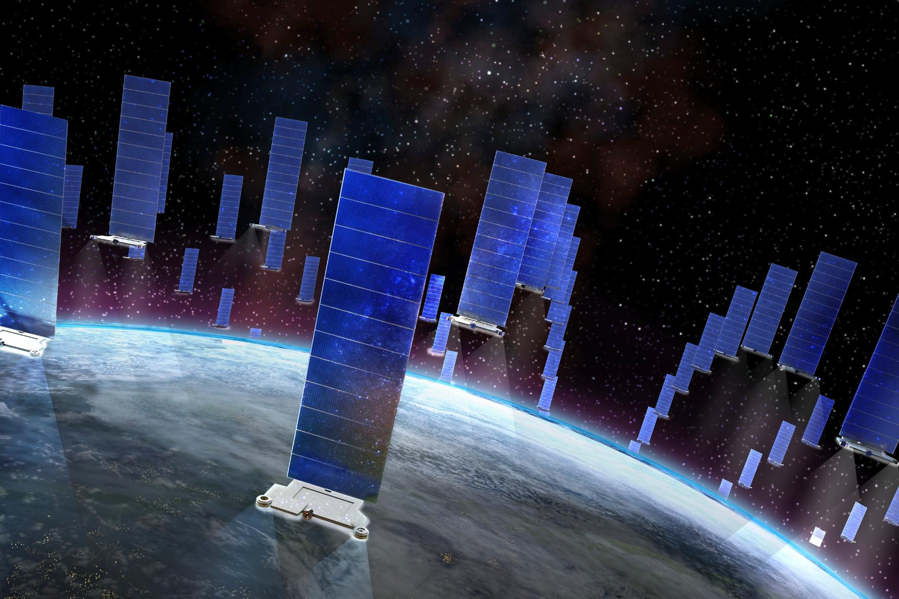

Le numérique est souvent perçu à tort comme un médium immatériel. 

La métaphore du "cloud"[^1] (nuage), abondamment utilisée pour évoquer internet, suggère quelque chose de vaporeux et d'intangible, mais également d'omniprésent et hors d'atteinte[^2]. Derrière cette figure éthérée se cache cependant une réalité tangible, qu'il s'agisse des infrastructures bel et bien physiques utilisées par le réseau, ou ses impacts sur le monde dit "réel".

**Dans le cadre de cette recherche, vous allez explorer cette tension qui existe entre numérique dit "immatériel", et une forme de matérialité. Réfléchissez à ce que leur rencontre ou leur opposition révèle, sur le numérique comme sur notre réalité.**

Ainsi, [Red Lines d'Evan Roth](https://redlines.network/) est une oeuvre en ligne qui évoque les imposants câbles de télécommunication sous-marins reliant les continents entre eux, qui font d'internet un réseau mondial. L’œuvre nous rappelle non seulement la physicalité du réseau, mais connecte également cette infrastructure moderne à l'histoire de l'empire colonial[^3] britannique (voir aussi [Ingrid Burrington](https://www.theatlantic.com/technology/archive/2015/11/submarine-cables/414942/) & [Tabita Rezaire](https://vimeo.com/248887185))

[Map d'Aram Barthol](https://arambartholl.com/map/) transpose dans la réalité un symbole bien connu[^4] de Google Map, sous forme d'une sculpture monumentale, révélant ainsi la superposition de ces deux mondes. 

D'autres artistes comme [Jan Robert Leegte](https://www.leegte.org/work/inmemoryofnewmaterialsgone/)[^5] ou [Zach Blas](https://zachblas.info/works/face-cages/) rendent également tangibles des symboles issues du numérique.

Avec [Get Popular Vending Machine de Dries Deporter](https://driesdepoorter.be/vendingmachine/), le monde numérique fait également irruption dans le notre, via un distributeur de followers[^6].

[Alerting Infrastructure de Jonah Brucker-Cohen](https://www.coin-operated.com/2010/05/09/alerting-infrastructure-2003/) provoque la destruction physique d'un mur, à chaque visite du site de l'institution où l’œuvre est exposée.

[^2]: 
[^3]: 
[^4]: 
[^5]: 
[^6]: 
[^1]: 