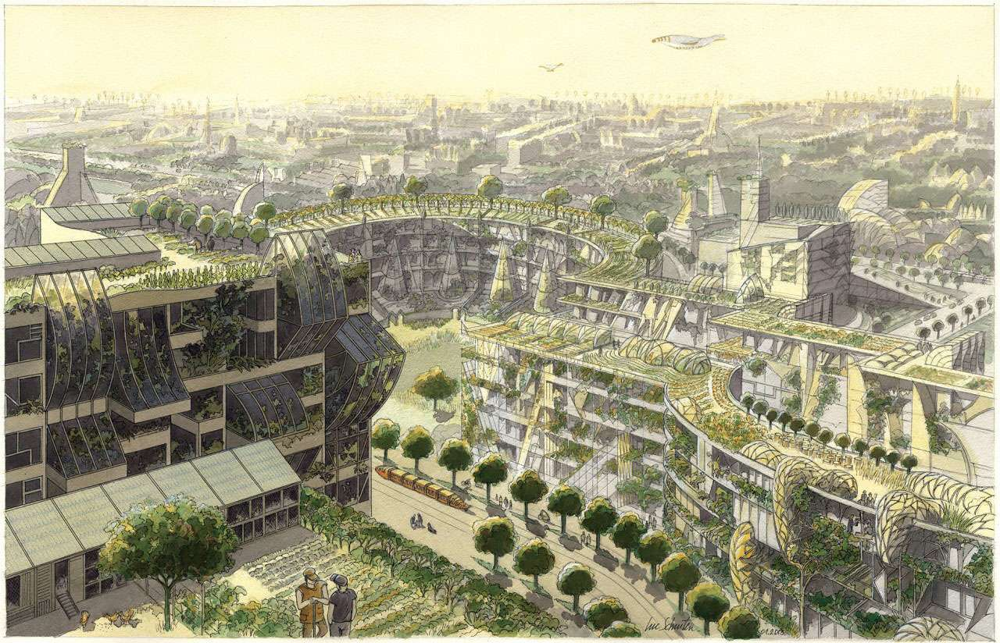
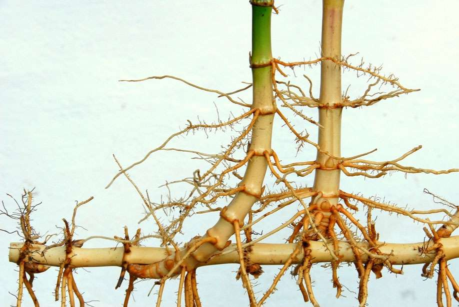
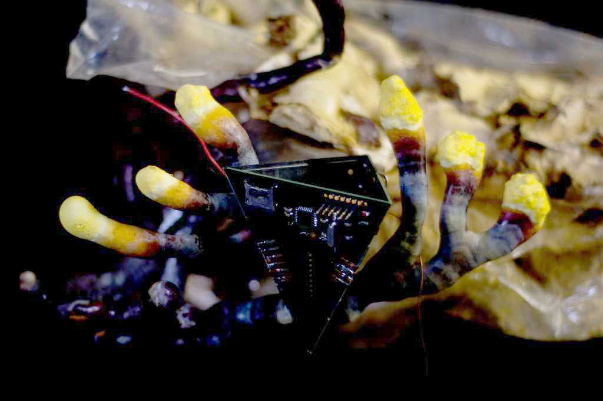

On oppose souvent technologie et nature. On peut néanmoins créer de nombreux parallèles enrichissants en comparant le numérique avec le monde végétal et fongique (les champignons).

Ainsi, les ramifications des racines et [rhizome](https://fr.wikipedia.org/wiki/Rhizome) des plantes[^2] peuvent évoquer tant la structure des réseaux de télécommunication[^4] que l'organisation des circuits imprimés[^3]. Les arbres et champignons sont connus pour communiquer entre eux à la manière de ce qu'on appelle parfois le[^5] [wood wide web](https://fr.wikipedia.org/wiki/R%C3%A9seau_mycorhizien).

L'artiste [Sarah Grant](https://www.chootka.com/projects/); fascinée par les réseaux et la télécommunication, mêle dans plusieurs de ses projets végétaux et technologie. [Martin Howse](http://www.1010.co.uk/org/radiomycelium.html) utilise des réseaux de champignons[^6] comme antennes/senseurs connectés à de l'électronique.

[Biomodd d'Angelo Vermeulen](http://www.angelovermeulen.net/?portfolio=biomodd) est un projet collaboratif qui crée un écosystème[^7] de plantes et d'algues autour d'un ordinateur, de la chaleur qu'il produit, etc.

Les notions d'agriculture ou de jardin peuvent servir de support à une réflexion sur notre rapport personnel, éthique, économique, politique à la technologie. L'intérêt croissant pour l'agriculture biologique et locale, ou pour les potagers collectifs[^8] fait écho à un besoin grandissant d'également développer des pratiques numériques échappant à la logique destructive du techno-capitalisme. 

En 1998 déjà, Mark Bernstein [s'inspirait des jardins et des parcs](https://www.eastgate.com/garden/) pour réfléchir aux formes de navigation sur les sites web. Plus récemment, Viznut[^10] nous invite à [repenser l'informatique sous l'angle de la permaculture](https://www.eastgate.com/garden/). On voit également des personnes déplacer leur présence en ligne de réseaux sociaux formatés vers des "[jardins numériques](https://www.technologyreview.com/2020/09/03/1007716/digital-gardens-let-you-cultivate-your-own-little-bit-of-the-internet/)", version contemporaine des "pages personnelles" des années 90. 

De façon plus large, Sue Gross propose d'abandonner la culture de la machine et de l'ingénieur pour adopter la culture du jardin et du jardinier. [Le mouvement éco-futuriste "solarpunk"](https://www.thejaymo.net/long-form/solarpunk-rusted-chrome/) veut inspirer le même type de changement culturel et politique, en proposant de nouvelles utopies _vertes_[^1].

Le projet [terra0](https://www.terra0.org/) vise à créer des écosystèmes augmentés capables, grâce à la blockchain d'agir dans la sphère économique. Ainsi, une forêt auto-propriétaire pourrait gérer elle même l'exploitation de ses propres arbres[^9], afin d'accumuler du capital, d'acheter plus de terrain et donc de s'étendre.

**Dans le cadre de cette recherche, vous allez explorer, questionner, repenser un aspect du numérique en lien, en parallèle avec, ou en s'inspirant du monde végétal/fongique.**

[^1]: 
[^2]: 
[^3]: 
[^4]: 
[^5]: 
[^6]: 
[^7]: 
[^8]: 
[^9]: 
[^10]: 