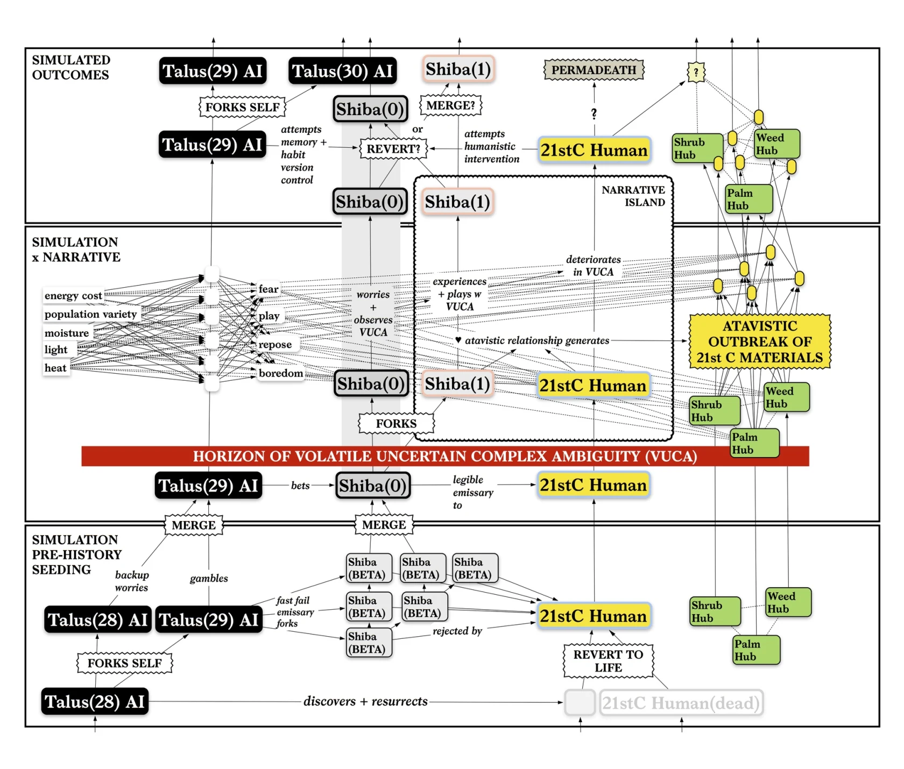
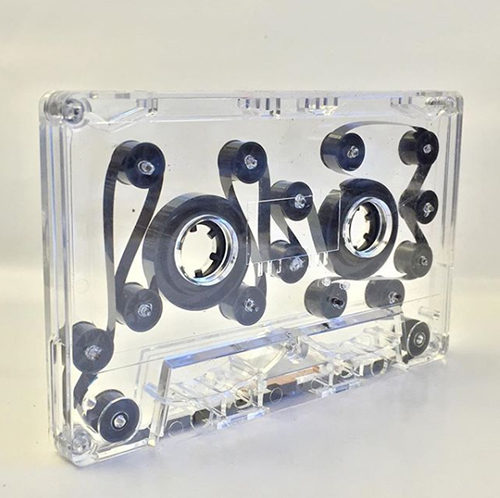
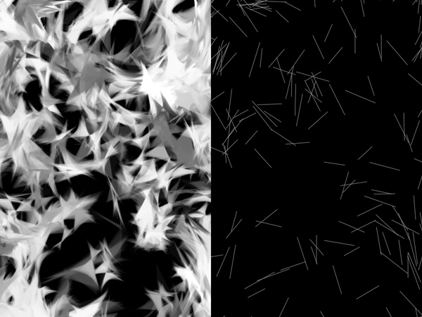
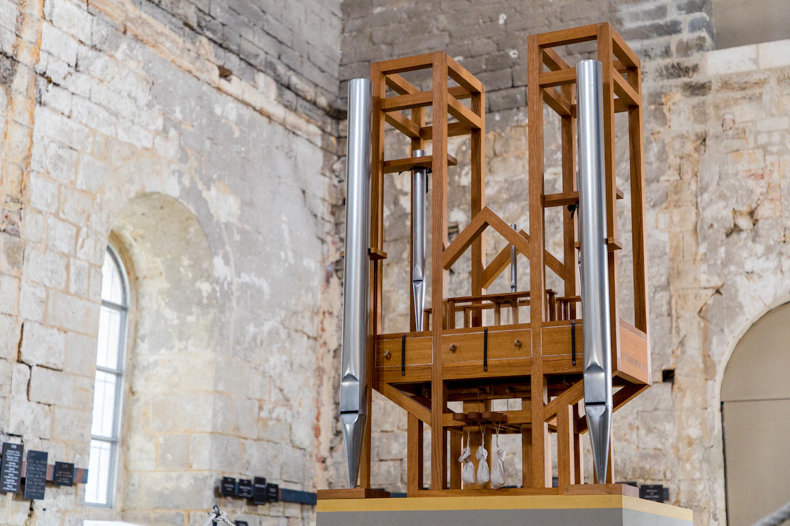

(par opposition à l'obsolescence programmée)

**Dans le cadre de cette recherche, vous allez proposer un dispositif génératif, sans interaction avec le spectateur, destiné à fonctionner seul pendant un temps important (à l'échelle d'une journée, d'une année, d'un siècle, ...). Vous explorerez entre autres la question suivante : comment générer une forme de hasard ou d'arbitraire? **

Ainsi, avec sa trilogie ["Emissaries", Ian Cheng](https://www.moma.org/magazine/articles/40) propose une série de "films infinis", basés sur une "simulation"[^4] dans laquelle des personnages autonomes, inspirés du début de l'humanité, interagissent avec un scénario cyclique.

De nombreux artistes, comme [Casey Reas](https://reas.com/)[^9], créent des dessins et animations abstraits qui combinent une série de règles simples ([et parfois explicitées](https://reas.com/compendium_text/)) pour créer des oeuvres visuelles complexes. Le génératif n'est pas forcément visuel ; l'artiste et chercheuse [Allison Parrish](https://www.decontextualize.com/) crée textes, mots et écritures à partir de code (un de ses livres génératifs est disponible [à la bibliothèque](https://ils.bib.uclouvain.be/uclouvain/documents/2044236)). 

["Music for Airports"](https://reverbmachine.com/blog/deconstructing-brian-eno-music-for-airports/) est un album de Brian Eno d'abord conçu comme une installation sonore, dans laquelle une série boucles de sons, désynchronisées (réalisées avec des boucles de bande magnétiques[^5]) créent une composition générative sans fin. D'autres musiciens utilisent ce principe de boucles, comme Chris Meloche ("[Loop 6](https://silentrecords.bandcamp.com/album/recurring-dreams-of-the-urban-myth)", une pièce de 6 heures de musique diffusée pour la première fois sur une radio londonienne, une nuit de 1994) ou [AMULETS](https://www.youtube.com/watch?v=hJpyuzH0798).

[ASLSP (As Slow as Possible)](https://fr.wikipedia.org/wiki/Organ%C2%B2/ASLSP)[^10] est une composition musicale de John Cage pour piano ou orgue destinée, comme son nom l'indique, à être interprétée aussi lentement que possible. Une version de presque 15h a été jouée en 2009. Démarrée en 2001, une version de 639 années de long est en train d'être jouée à la Cathédrale de Halberstadt.

Voyez aussi [The Clock of the Long Now](https://en.wikipedia.org/wiki/Clock_of_the_Long_Now), une horloge conçue pour fonctionner pendant 10 000 ans, ou la problématique des [messages d'avertissement de longue durée sur les déchets nucléaires](https://fr.wikipedia.org/wiki/Messages_d%27avertissement_de_longue_dur%C3%A9e_sur_les_d%C3%A9chets_nucl%C3%A9aires), qui obligent à concevoir des projets sur des échelles dépassant les civilisations humaines[^6].

Sur la notion d'aléatoire, les fonctions `random()` offertes par la plupart des langages de programmation ne produisent en réalité que des résultats _pseudo-alétoires_ basés sur des formules mathématiques. Le vrai hasard, plus imprévisible qu'un algorithme, peut être produit [en faisant intervenir des processus physiques](https://fr.wikipedia.org/wiki/G%C3%A9n%C3%A9rateur_de_nombres_al%C3%A9atoires_mat%C3%A9riel).[^7] Les générateurs de nombres aléatoires sont en général disponibles sous formes de circuits électroniques ou de cartes d'extension, mais peuvent prendre des formes plus inattendues, comme [le mur de lampes à laves utilisé par Cloudflare](https://www.vice.com/fr/article/59yapb/10-du-trafic-internet-est-securise-par-un-mur-de-lampes-a-lave).[^8]

⁂

Pour guider notre réflexion, nous pouvons nous intéresser à la métaphore du sable. Le sable représente le temps qui passe, qu'il s'agisse du sablier, des dunes qui envahissent les ruines d'une citée abandonnée[^2], ou des millions d'années d'érosion qui mènent à sa formation. Le hasard fait que le silicium présent dans le sable est un des composants entrant dans la fabrication des processeurs[^1], ce qui en fait un élément éminemment numérique (et ce qui nous rappelle au passage [la matérialité du numérique](../nuage)).

Le sable nous dit quelque chose de l'apparente infinité des combinaisons possibles entre un grand nombre d'éléments ; le petit tas de sable qui se forme dans le sablier[^3] est toujours similaire, mais pourtant jamais identique.

Enfin, difficile de ne pas mentionner la locution du "grain de sable dans la machine", l'élément perturbateur et inattendu. 

[^1]: 
[^2]: 
[^3]: 
[^4]: 
[^5]: 
[^6]: 
[^7]: 
[^8]: 
[^9]: 
[^10]: 